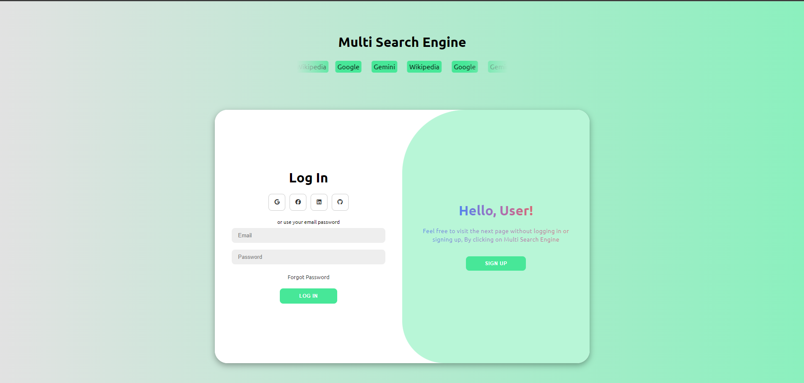
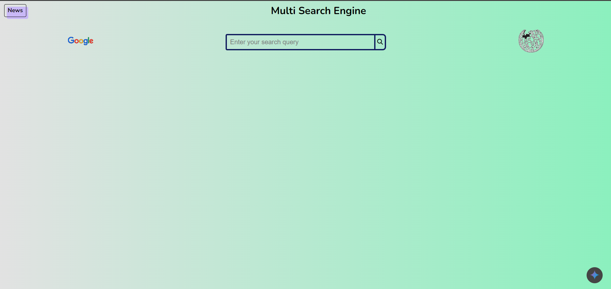
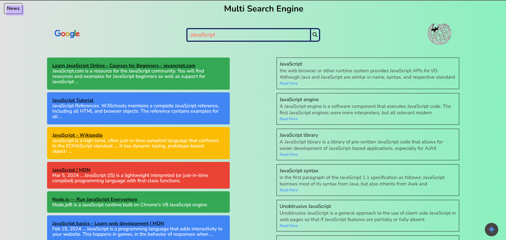
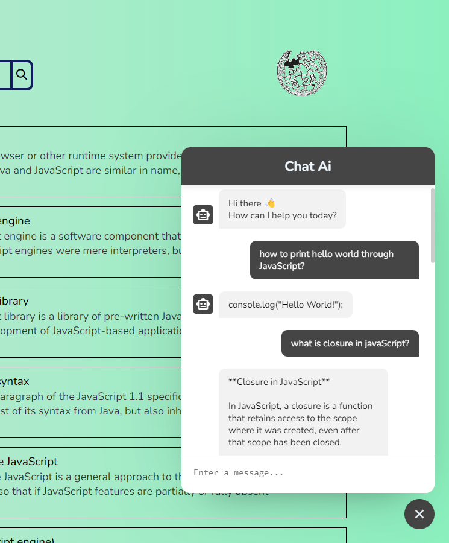
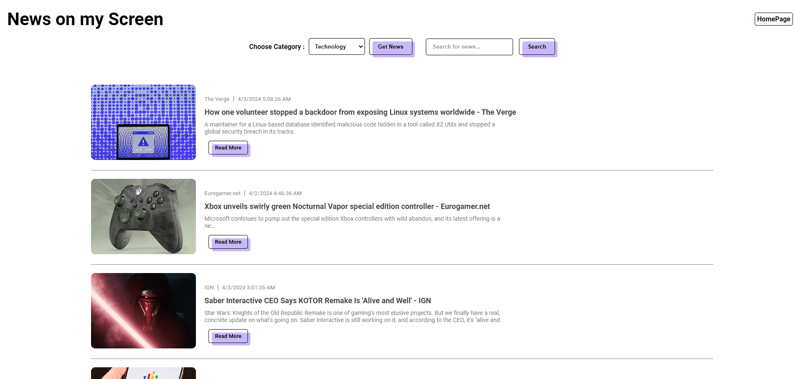

# Multi-Search-Engine

This project aims to create a versatile search platform that combines the power of Google, Gemini, and Wikipedia APIs. It provides users with a seamless experience, allowing them to explore search results from various sources within a single interface. The application is built using HTML, CSS, and JavaScript.

## How it Works

The Multi-Search-Engine application features a search bar where users can enter their queries. Once a query is submitted, the application utilizes the respective APIs of Google, Gemini, and Wikipedia to retrieve search results. These results are then presented to the user in a unified manner, allowing for easy comparison and exploration.

## Technologies Used

* HTML: Provides the structure and content of the web page.
* CSS: Styles the visual appearance of the web page.
* JavaScript: Enables interactivity and dynamic functionalities within the web page, such as handling user input and fetching data from APIs.

**Here's a visual representation of the workflow:**

## Setup Instructions

1. Clone the repository:
git clone [here](https://github.com/Avinash01-GIT/Multi-Search-Engine)

## Live Demo

See the Multi-Search-Engine in action at: [here](https://multi-search-engine-9zabad1bk-avinashs-projects-b8a41a8f.vercel.app)

## Contributing

Contributions are welcome! If you have any suggestions, bug fixes, or additional features you'd like to see, please feel free to open an issue or submit a pull request.
